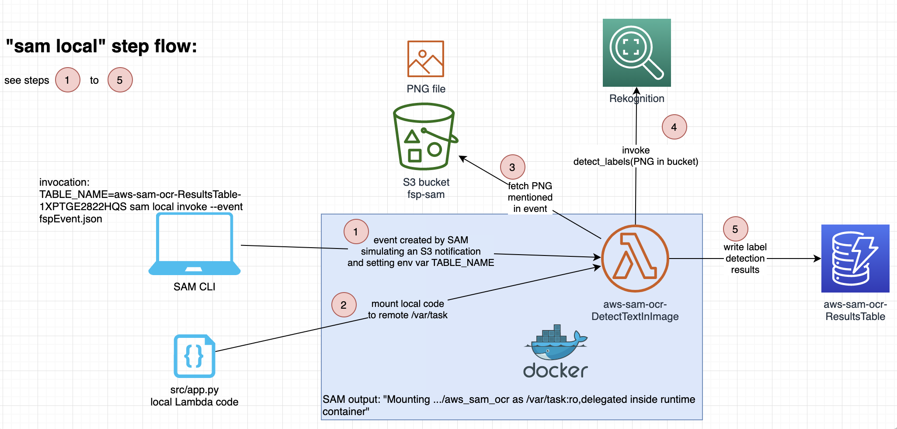

# AWS-SAM-local

This repo adds an architecture overview of the steps described in https://docs.aws.amazon.com/serverless-application-model/latest/developerguide/serverless-example-s3.html. That example project can be regarded as

* How to use SAM to deploy an infrastructure
* How to use "sam local" to deploy a Lambda function to a locally running Docker container
* How to create a simple showcase for how Amazon Rekognition

The descriptions found here are focussing on the 2nd topic: how to use "sam local".

# Architecture overview

Please find the respective draw.io file in the draw.io/ folder!
